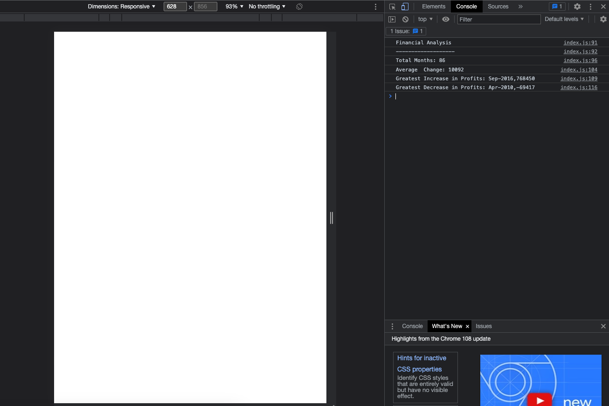

# Console-Finances

1. After the array, I have added the header of the challenge.
2. I have added a month count code to the project, reflecting the total number of month in the array.
3. Average of change in Profit/losses code added.
4. Added a function to reflect the biggest number of the array.
5. Added a function to reflect the smallest number of the array.

- GitHub Link of the project: https://github.com/diegodagostim/Console-Finances
- Deployed link: https://diegodagostim.github.io/Console-Finances/

